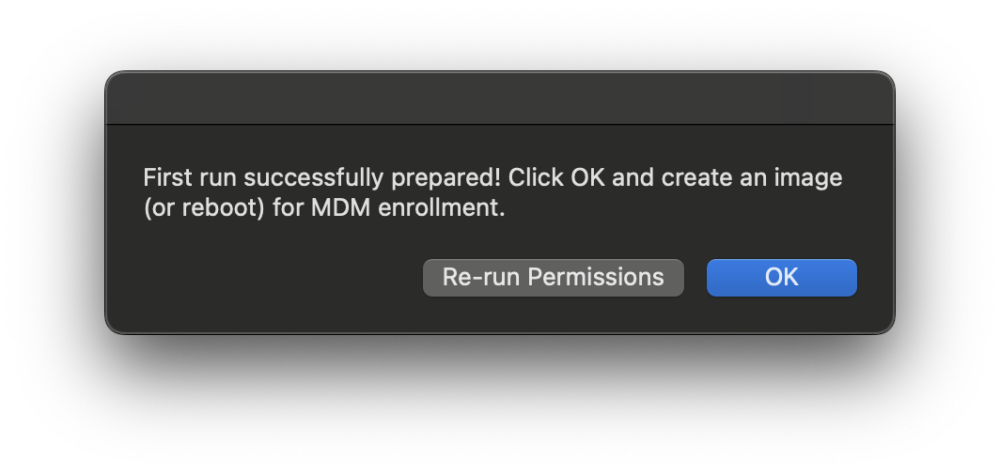

# enroll-ec2-mac: Welcome!

enroll-ec2-mac is an AppleScript made to **automatically enroll** [Amazon Web Services Elastic Compute Cloud (EC2) Mac instances](https://aws.amazon.com/ec2/instance-types/mac/) into a **mobile device management (MDM)** solution. enroll-ec2-mac is made to ensure the MDM “pairing“ relationship isn't broken for MDM enrollment. Without that pairing, an EC2 Mac instance isn’t able to ”listen“ for new or updated profiles from the MDM server. enroll-ec2-mac performs all of this without any user interaction after AMI configuration (as per the instructions below). Included is a subroutine to automate the issuance and retrieval of **Jamf** enrollment profiles and more MDM providers below. 

---

#### Learn more about Amazon EC2 Mac instances [here!](https://github.com/aws-samples/amazon-ec2-mac-getting-started/tree/main/apps-and-scripts)

---

[](https://www.youtube.com/watch?v=8JOCR7-cOjc)
#### [Click here for a video walkthrough of setting up an EC2 Mac and using this repository to automate enrollment into Jamf Pro.](https://www.youtube.com/watch?v=8JOCR7-cOjc)

---

### enroll-ec2-mac retrieves a **secret** (credentials/passwords) stored in **AWS Secrets Manager**. 

Included are [AWS CloudFormation](https://aws.amazon.com/cloudformation/) and [HashiCorp Terraform](https://www.terraform.io/) templates to get these set up. Either of these will automate creating the AWS Secrets Manager secret, Identity and Access Management policy, role, and instance profile needed for enroll-ec2-mac to retrieve credentials. Alternatively, if using AWS Systems Manager Parameter Store instead, templates are also included, and a setting must be changed to match (see the section Settings below). Manual instructions to set up the secret are also included at the bottom of this page. 

---

### Credential Setup

1. Gather the appropriate **credentials** and store them in **AWS Secrets Manager.** If you're using one of the templates, you'll be prompted for each of these. The default secret ID in the script is `jamfSecret`, and requires 5 values for the following keys (with sample values below):
    1. `jamfServerDomain` `("jamfurl.jamfcloud.com")`
    2. `jamfEnrollmentUser` `("enrollmentUserExampleName")`
    3. `jamfEnrollmentPassword` `("enrollment3x4mplep455w0rd")`
        * For Jamf Pro, these hold a Jamf API `client_id` and `client_secret` created in the **Jamf** console, and its role only requires **Create** permission for **Computer Enrollment Invitations**.
        * Jamf API Client Credentials are required. The `jamfEnrollmentUser` field holds the **Client ID** and `jamfEnrollmentPassword` holds the **Client Secret**.
        * * *As of March 31st, 2024, Jamf Pro has deactivated Basic authentication, deprecating the use of Jamf Pro Standard Accounts for communicating with the API.  **API calls must now be performed with API roles and clients, unless explicitly reactivated in Jamf Pro settings.**.*
        * Additional permissions for Jamf API are required for other optional features, such as preloading information and removing device records.
        
        * **Not using Jamf Pro as your MDM?**
          * If using **Kandji**, set `jamfEnrollmentUser` to **ID of your desired blueprint** and `jamfEnrollmentPassword` to its **enrollment code**.
          * Support for additional MDMs will be added as available.
   
    4. `localAdmin` `("ec2-user")`
        1. The default is `ec2-user` unless a change is made outside of these instructions. Must be an administrator account.
    5. `localAdminPassword` `("l0c4l3x4mplep455w0rd")`
        1. Password for `localAdmin` administrator account.
        2. These credentials may be reset/cleared programmatically after enrollment completes.
2. Create AWS **Identity and Access Management (IAM) assets** to enable access to the above secret. The IAM policy, role, and instance profile (noted here with ㊙️🪪, the emoji for "Secret" and "Identification," and placed throughout for emphasis) are all automatically created with either template. See near the end for a sample manual policy.
    1. Attach this **㊙️🪪 IAM Instance Profile** to the instance you're starting. 

### AMI Setup

1. [**Start** an EC2 Mac instance on a Mac dedicated host from an Amazon-vended macOS AMI.](https://docs.aws.amazon.com/AWSEC2/latest/UserGuide/ec2-mac-instances.html#mac-instance-launch)
    1. [**Attach** the above **㊙️🪪 IAM Instance Profile**](https://docs.aws.amazon.com/IAM/latest/UserGuide/id_roles_use_switch-role-ec2_instance-profiles.html) to the instance.
2. **Connect** via SSH, **enable** Screen Sharing/VNC, and **set** the admin password to match the one saved in the Secret.
    1. In a single line:` sudo /usr/bin/dscl . -passwd /Users/ec2-user 'l0c4l3x4mplep455w0rd' ; sudo launchctl enable system/com.apple.screensharing ; sudo launchctl load -w /System/Library/LaunchDaemons/com.apple.screensharing.plist`
3. **Connect** to the Mac **GUI** (via VNC or Screen Sharing) and **log in** with the above password.
3. Enable **Automatically log in as** for the current user in **System Settings -> Users & Groups.**
5. **Place** `enroll-ec2-mac.scpt` in `/Users/Shared`.
    1. IMPORTANT: Set the **secret ID** (either by name or with the complete [ARN](https://docs.aws.amazon.com/IAM/latest/UserGuide/reference-arns.html)) by manually setting `MMSecret` in the script, or writing the ID to a plist with the below command. 
        - `defaults write /Library/Preferences/com.amazon.dsx.ec2.enrollment.automation MMSecret "jamfSecret-YOUR-SECRET-ID"`, replacing what's in quotes with the ID or ARN of your secret.
        - *This secret is the one your  **㊙️🪪 IAM Instance Profile** can access.*
        - *Unable to use Secrets Manager? Options for using Parameter Store (with CloudFormation and Terraform templates) or statically setting the variables are commented in the script runtime.*
6. In **Terminal**, type the following command: 
    1. `osascript /Users/Shared/enroll-ec2-mac.scpt --setup`
    2. Note: if you would like to use DEPNotify (see below for why), add the `--with-screen` flag to activate.
           - e.g. `osascript /Users/Shared/enroll-ec2-mac.scpt --setup --with-screen`
    - *In the event the Jamf server credentials are incorrect, an error will appear halting this process. Correct these credentials to continue.*
7. **Follow the prompts** to enable System Events, Accessibility, and App Management (if using DEPNotify) permissions as needed. These will be enabled for the `osascript` process and may be reverted programmatically, included in the cleanup routines if `prodFlag` is set to `1`.
    1. After a short delay, enroll-ec2-mac will try to access all the permissions that it will need to during actual enrollment, but not performing all of the enrollment actions.
        - During this process, it is normal for the screen to flash a few times.
        - *Optional: if `useDEPNotify` is set to `true`, or the `--with-screen` flag is used, prompts for **App Management** will appear and the screen will flash. DEPNotify is used to keep users from interfering in the enrollment process, but is optional if automatic login is set, since enrollment can transparently occur before a user logs in.*
    2. In the event of an error, click **Re-run** and respond to the prompts again.
    3. If a final prompt or error does not appear after some time (over 2 minutes), run the following command to reload the LaunchAgent and re-run the task:
```
launchctl unload -w /Library/LaunchAgents/com.amazon.dsx.ec2.enrollment.automation.startup.plist ; launchctl load -w /Library/LaunchAgents/com.amazon.dsx.ec2.enrollment.automation.startup.plist`
```
8. Once you receive the below message, **click OK** and close Screen Sharing/VNC. 
**Make sure to click OK before creating your image.** If OK is not clicked, enroll-ec2-mac will *re-attempt setup (and not enrollment)* on subsequent runs until it's clicked.
10. Optional: **disable screen sharing** via the command line.
    1. `sudo launchctl disable system/com.apple.screensharing ; sudo launchctl unload -w /System/Library/LaunchDaemons/com.apple.screensharing.plist`
11. After clicking OK, [**Create an image**](https://docs.aws.amazon.com/AWSEC2/latest/UserGuide/creating-an-ami-ebs.html) from the running instance.
    1. Follow the linked instructions to **Create a Linux AMI from an instance** (instructions also cover macOS instances).
    2. Workflow was tested with **“No reboot”** enabled.
        - *Note: if the instance is rebooted or logged out after clicking OK,* **enrollment will occur.**
    3. “Delete on termination” is recommended to be **unchecked** to keep the AMI after [terminating the template instance](https://docs.aws.amazon.com/AWSEC2/latest/UserGuide/preserving-volumes-on-termination.html).
12. When AMI moves from **Pending** to **Available**, launch a new instance with the AMI. 
    1. This process may take an hour or more depending on storage class and data volume.
13. When new instance is launched using this AMI, it will enroll **automatically**, and without any further intervention. 
    1. IMPORTANT: Ensure that any new instance launched from this AMI has an appropriate **㊙️🪪 IAM instance profile** that can retrieve the credentials.
    2. Cleanup (`prodFlag`) is available to revoke permissions and remove files.
    3. Code in `enroll-ec2-mac` can auto-enable Screen Sharing when enrollment is complete.


### Troubleshooting

* *Important:* if you are testing a manual Jamf MDM enrollment without this script, a preference key **must be set before enrollment**, or MDM profiles will not properly deploy to the cloud instance. This key is set **automatically** as part of the enroll-ec2-mac script. The command below will set the preference key manually.
  ```sh
    sudo defaults write /Library/Preferences/com.jamfsoftware.jamf is_virtual_machine 0
    ```
* The first spot to check during a script failure is the **㊙️🪪 IAM Instance Profile**: if the script hangs or crashes (any error regarding `“{{ }},{{ }}")`, it may not have access to the secrets it needs, or isn’t parsing them correctly. 
    * To test, in Terminal, manually check the secret (changing `jamfSecret` to the name or ARN of your secret):
        * `aws secretsmanager get-secret-value --secret-id jamfSecret --query SecretString`
* If using an **HTTP/HTTPS proxy** and only basic profiles appear (i.e. no Self Service or pushed apps, additional profiles assigned are not in System Settings), the proxy needs to be set for the `appstore` process itself. Use the code below to make the change, replacing "proxy.server.address.here:8080" with your proxy server and port (inside the quotes):
     ```sh
      PROXY_ADDRESS="proxy.server.address.here:8080"
      cat <<EOF | sudo tee /var/db/appstore/.curlrc
      proxy = $PROXY_ADDRESS
      EOF

      sudo chown -R _appstore:_appstore /var/db/appstore/.curlrc
      ```
* If pushing a **System Extension** profile with "Allow users to approve system extensions" set to false (unchecked), note that EC2 Mac instances use a System Extension for its network driver, which is **critical** to the cloud instance communicating with any external infrastructure. In the event that a profile of this type is pushed, the instance will become out-of-contact and fail a Status Check on the AWS EC2 console, and will be entirely disconnected from network. Allowlisting the EC2 Mac Elastic Network Adapter (ENA) extension will ensure consistent network connectivity.
    * A profile allowing the team identifier, `R8K7E88CP3` or explicitly the extension `com.amazon.DriverKit.AmazonENAEthernet` would need to be pushed to enrolling EC2 Mac instances **before** other System Extension profile.


---

## Settings


enroll-ec2-mac has some options to customize to suit your deployment. To set any of these preferences, type `defaults write com.amazon.dsx.ec2.enrollment.automation `, the key, and the value. For example, to set your secret ID (the only required setting), the full command would be:

`defaults write com.amazon.dsx.ec2.enrollment.automation MMSecret "jamfSecretID-GoesHere"` 

(replacing `"jamfSecretID-GoesHere"` with your secret ID or ARN)

- `MMSecret` is the ID of the secret for enroll-ec2-mac to read from. (default `jamfSecret`)
- `invitationID` is a value for the Jamf invitation ID (numeric string). By default this is read/generated via Jamf API, but can be manually set.
- - *Note: If an invitation ID is set, the Jamf API **will not be called.***
- `retrievalType` changes how the secret is read. By default, this is set to `SecretsManager` (AWS Secrets Manager), but may be set to `ParameterStore` (AWS Systems Manager Parameter Store). (default `SecretsManager`)
- `useDEPNotify` activates (if set to `true`) a DEPNotify UI that enroll-ec2-mac uses to shield the display from a user during enrollment. This is set to `true` when the `--with-screen` flag is used, and explicitly `false` with the `--no-screen` flag. (default `false`, *Note: changed from `true` in earlier versions*)
- `autoLogin` enables/disables automatic login of the stored user. Note: it is recommended to use a User Data script during setup to automate this setting, as some versions of macOS require additional commands. (default `true`)
- `invPreload` enables inventory preload via Jamf API. Default setting in code is to set **Vendor** to **AWS** when enabled. (default `false`)
- `prodFlag` enables cleanup routines to reset the TCC databases, delete the script, and remove associated files. Some optional commands are included and commented out, including to remove the active instance profile. Set to `1` to enable. (default `0`, *Note: changed from `testFlag` in earlier versions, which was only available to set inline.*)
---

## Manual Configuration for AWS Secrets Manager & IAM

enroll-ec2-mac uses a single secret that contains 5 key/value pair entries: the Jamf URL (`jamfServerDomain`), API credentials (`jamfEnrollmentUser` & `jamfEnrollmentPassword`), and local admin credentials (`localAdmin` & `localAdminPassword`). The first three are required to generate the profile, and the final two to apply them to the Mac. Example values are in **Credential Setup** at the top of the page. The EC2 instance needs an appropriate **㊙️🪪 IAM instance profile** applied to itself to read these secrets, as well. 

The Jamf API permissions for enroll-ec2-mac *only* requires the client have **Create** permission for **Computer Enrollment Invitations**, and none else. See below for an example of an **㊙️🪪 IAM instance profile** including the appropriate access.

---

**Please ensure that you have replaced the ARN next to "Resource" with the full ARN of your secret.** If editing manually:
* replace **`⚠️⇢region-name`** with the appropriate **AWS region** (e.g. `us-east-1`).
* replace **`1111222233333`** with the appropriate **AWS account ID**.
* replace `jamfSecret` with **your** applicable **Secret ID**.


```
{
    "Version": "2012-10-17"
    "Statement": [
        {
            "Action": [
                "secretsmanager:ListSecrets",
                "secretsmanager:ListSecretVersionIds",
                "secretsmanager:GetSecretValue",
                "secretsmanager:GetResourcePolicy",
                "secretsmanager:GetRandomPassword",
                "secretsmanager:DescribeSecret"
            ],
            "Effect": "Allow",
            "Resource": "arn:aws:secretsmanager:⚠️⇢region-name:111122223333:secret:jamfSecret",
            "Sid": ""
        }
    ]
}
```

---

THERE IS NO WARRANTY FOR THE PROGRAM, TO THE EXTENT PERMITTED BY APPLICABLE LAW. EXCEPT WHEN OTHERWISE STATED IN WRITING THE COPYRIGHT HOLDERS AND/OR OTHER PARTIES PROVIDE THE PROGRAM “AS IS” WITHOUT WARRANTY OF ANY KIND, EITHER EXPRESSED OR IMPLIED, INCLUDING, BUT NOT LIMITED TO, THE IMPLIED WARRANTIES OF MERCHANTABILITY AND FITNESS FOR A PARTICULAR PURPOSE. THE ENTIRE RISK AS TO THE QUALITY AND PERFORMANCE OF THE PROGRAM IS WITH YOU. SHOULD THE PROGRAM PROVE DEFECTIVE, YOU ASSUME THE COST OF ALL NECESSARY SERVICING, REPAIR OR CORRECTION.

---

*"There's no step 13!"*
